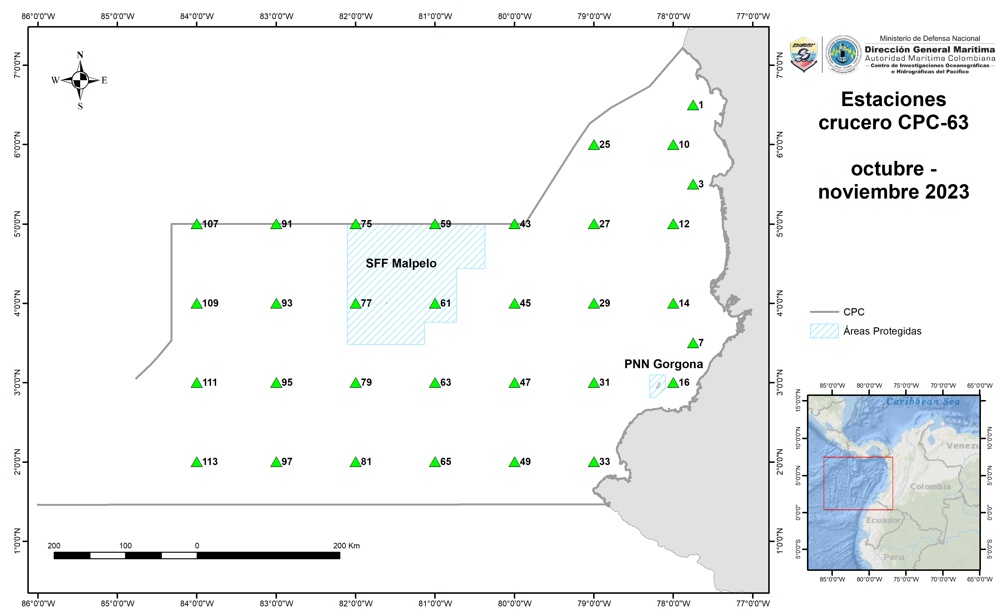

Centro de Investigaciones Oceanográficas e Hidrográficas del Pacífico

Dirección General Marítima

Diplomado cuatificación de carbono en ambientes oceánicos

Propuesta del problema de investigación

Humberto Quintana Manotas

Fredy Albeiro Castrillón
        
        
# Objetivo general

Establecer si existe una relación entre la biodiversidad del fitoplancton y la productividad primaria (carbono y clorofila *a*) en la superficie de la ensenada de Panamá en los meses de octubre y noviembre del 2023.

# Planteamiento del problema

El fitoplancton desempeña un papel fundamental en la captura de carbono ($CO_2$) en los océanos y la liberación de oxígeno ($O_2$) a la atmósfera [@righetti2019global]. Como productores primarios, constituyen la base de los ecosistemas marinos, facilitando el flujo de energía a lo largo de la red trófica y promoviendo el transporte de materia orgánica hacia las profundidades oceánicas mediante su hundimiento [@guidi2016plankton]. Debido a su importancia, numerosos estudios han abordado la relación entre la productividad primaria y la diversidad de especies en estas comunidades [@cardinale2009does; @goebel2013modeled; @righetti2019global]. 

Existen al menos tres  hipótesis sobre la relación entre la diversidad y la productividad [@cardinale2009separating]. La hipótesis  *Especies-Energía* (*species energy theory - SET*) propone que "la suma de todos los recursos influencia la riqueza de las especies por medio del control de los tamaños poblacionales y la estocasticidad de la extinción" [@cardinale2009separating; @wright1983species], la hipótesis de *Tasa de recurso* (*resource ratio theory*) propone que el "desbalance entre uno de dos recursos permite que la mayoría de las especies no sean capaces de competir, por lo tanto cuando existen estos desbalances la riqueza es mínima, presentando una relación unimodal (*concave-down function*)" [@cardinale2009separating]. La hipótesis del *Funcionamiento del Ecosistema-Biodiversidad* (*Biodiversity ecosystem functioning*), la diversidad de las especies actua como una variable independiente que controla la disponibilidad de los recursos y cómo estos serán utilizados para la productividad [@cardinale2009separating]. 

Aunque existe un consenso general que sugiere un aumento de la productividad con la diversidad — dado que las comunidades más diversas incluyen taxones de alta productividad [@cardinale2009does] — la relación entre estos dos factores sigue siendo objeto de debate, sin conclusiones definitivas. Una de las dificultades que se ha encontrado para tener claridad sobre lo que se está relacionando es el uso sin distinciones de los conceptos *diversidad* y *productividad* [@cardinale2009does], muchos trabajos [@rousseaux2012climate; @goebel2013modeled; @li2010modeling; @napoleon2014dynamics] han usado la riqueza como una de las medidas de diversidad, sin embargo no se han explorado otras medidas que representan de una manera más adecuada todas las dimensiones de la diversidad a nivel de la comunidades (*e.g* @jost2006entropy).  


Por lo anterior, en este trabajo se pretende examinar y describir cual es el tipo de relación que hay entre la productividad primaria, representada como la biomasa de diferentes grupos del fitoplancton (*e.g.* diatomeas y dinoflagelados) y la biodiversidad calculada con los números de Hill que representan la "*diversidad verdadera*" [@chao2014unifying; @jost2010relation], tomando como fuente de datos las muestras obtenidas en el crucero oceanográfico CPC - 63 y los datos de sensores remotos para los meses de octubre y noviembre del año 2023.


# Metodología

## Área de estudio

La cuenca del Pacífico colombiano abarca un área de aproximadamente 339.100 km2 y está ubicada entre el paralelo 1°N en los límites con Ecuador y 7° N en los límites con Panamá. Esta cuenca se encuentra dentro de la provincia del Pacífico Oriental Tropical en la ecorregión de la Ensenada de Panamá [@costello2017marine; @spalding2007marine]. La zona donde se tomaron las muestras biológicas del crucero CPC-63 entre octubre y noviembre del 2023, corresponde a la zona económica exclusiva de Colombia (Figura 1).

```{r, echo=FALSE, fig.cap="Estaciones de muestreo del crucero CPC-63 del año 2023.", out.width="100%"}


```

## Fase de campo


Las muestras de fitoplancton se tomaron con botella Niskin de 10 litros de capacidad dentro de un carrusel muestreador SeaBird SBE 32 en las profundidades de 0, 20, 50 y 100 metros de profundidad, pero solo la muestra superficial va a ser tenida en cuenta para este trabajo. Una vez en cubierta el carrusel, se tomaron 1000 ml de agua en una botella de plástico ambar y se fijaron con Lugol. 

## Recuento celular y determinación taxonómica

El recuento de las células fue realizado siguiendo el método de sedimentación por cámara Utermöhl [@utermohl1958vervollkommnung], estas muestras fueron sedimentadas por un periodo de tiempo de 48 horas utilizando un cilindro de 100 mL de volumen. La observación de las muestras se realizó utilizando un microscopio invertido Leica DMi1 a magnificación de 100x, para observar las células con mayor detalle e utilizarón 400x y 1000x cuando era necesario. Se identificaron las especies utilizando claves taxonómicas y descripciones de [@balech1988dinoflagelados;@Omura2012marine]. Además, se verificó el estado taxonómico de las especies, autores y sinonimia mediante la base de datos Algaebase [@guiry2014algaebase].


## Análisis de datos

### Fuentes de datos

#### Diversidad.

Para los análisis de diversidad del fitoplancton se usarán los números de Hill calculados para cada una de las estaciones, estos se calcularon con el paquete “*vegan*” de R [@dixon2003vegan]. La fórmula para calcular el número de Hill incluye un parámetro $q$, que determina la sensibilidad del cálculo a la presencia de especies raras. Un valor alto de $q$ da más peso a las especies comunes, mientras que un valor bajo de q da más peso a las especies raras

- Número de Hill de orden cero ($q=0$): Es la riqueza de especies, es decir, el número total de especies presentes en una muestra o comunidad. La diversidad de orden cero ($q/0$) es completamente insensible a las frecuencias de especies y es más conocida como riqueza de especies [@jost2006entropy].

- Número de Hill de primer orden ($q=1$): Es la exponencial de la entropía de *Shannon*, y se define como $exp(H)$, donde $H = - \sum (p_i * ln(p_i)$) y $p_i$ es la proporción de individuos de la $i$-ésima especie. El número de Hill de primer orden se interpreta como el número efectivo de especies en una comunidad y se utiliza para tener en cuenta tanto la riqueza como la equitatividad de la comunidad. Este índice es sensible a las especies con abundancias medias [@jost2006entropy].

- Número de Hill de segundo orden ($q=2$): Es la inversa de la suma ponderada de las proporciones de las especies elevadas a la segunda potencia, es decir, $1 / \sum (p_i^{2})$. Este número de Hill se interpreta como la diversidad de orden superior y es más sensible a las especies comunes [@jost2006entropy].

#### Productividad.

Los datos de productividad se obtendrán del portal *Copernicus Marine Service*  que ofrece datos de modelos numéricos, observaciones *in-situ* y datos satelitáles. El conjunto de datos seleccionado para evaluar la relación entre la diversidad y la productividad será del *Global Ocean Colour (Copernicus-GlobColour), Bio-Geo-Chemical, from Satellite Observations (Near Real Time)* (*product ID: [OCEANCOLOUR_GLO_BGC_L4_NRT_009_102](https://data.marine.copernicus.eu/product/OCEANCOLOUR_GLO_BGC_L4_NRT_009_102/description)*), de este conjunto de datos se obtendrán la concentración de clorofila *a* total, la concentración de clorofila *a* aportada por las diatomeas, la concentración de clorofila *a* aportada por los dinoflagelados y  la productividad primaria expresada como carbono.

### Análisis relacionales

Una vez obtenidos los datos de ambas fuentes, se procederá a evaluar la relación estadística entre la diversidad total del ensamblaje del fitoplancton con la concentración de clorofila *a* total y la productividad primaria expresada como carbono. También se evaluaran las relaciones entre la diversidad de la diatomeas con la  concentración de clorofila *a* aportada por las diatomeas y la diversidad de los dinoflagelados con la concentración de clorofila *a* aportada por los dinoflagelados. 


# Literatura citada
